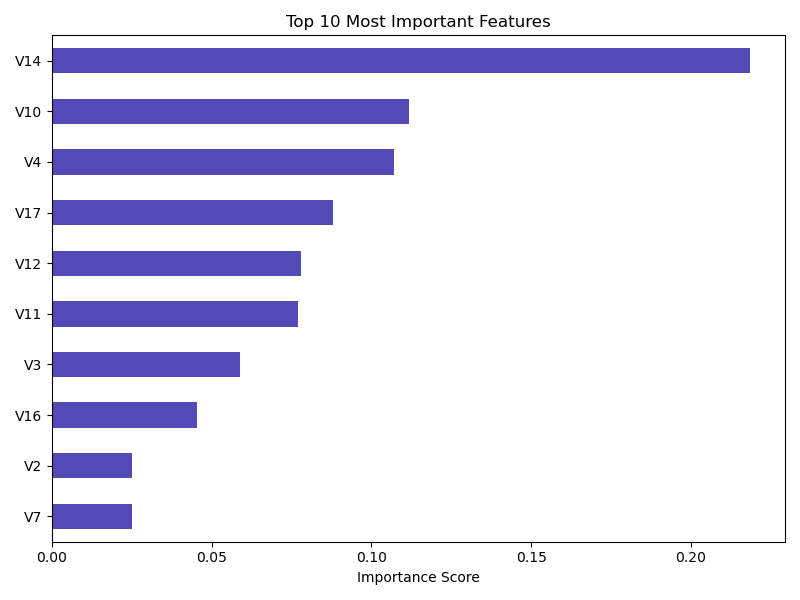
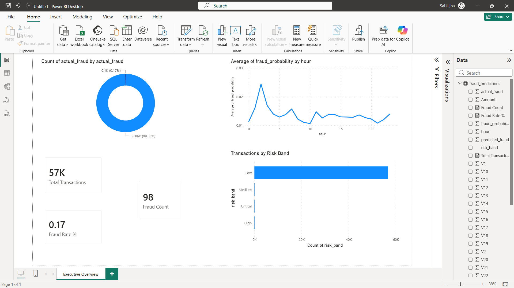
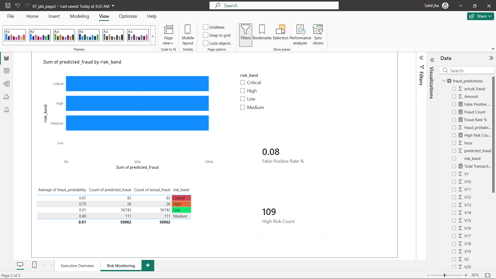
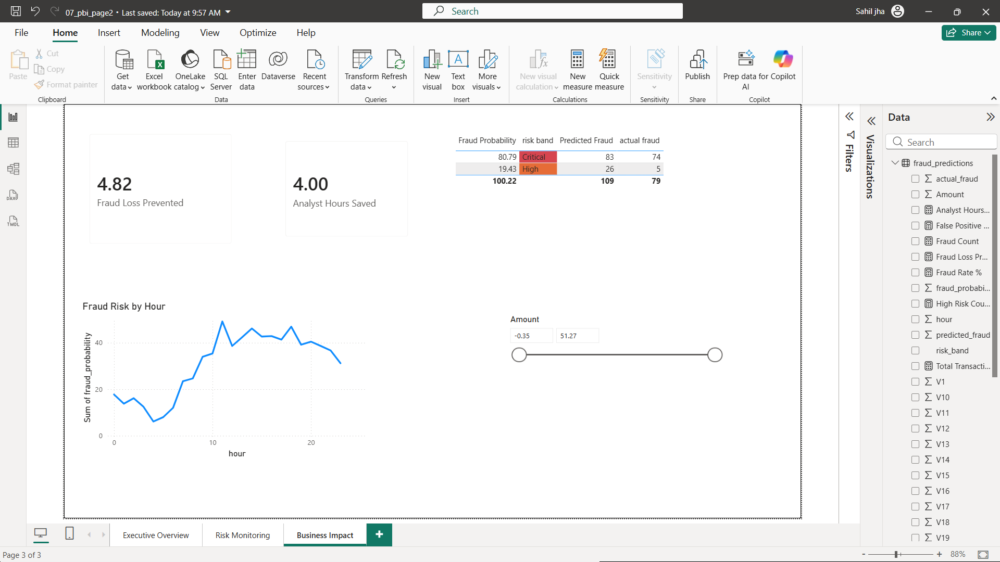

# credit-card-fraud-detection

## Problem Statement
284,807 credit card transactions with only 0.17% fraud rate. 
Built an end-to-end detection system to identify fraud transactions automatically.

## Tech Stack
- SQL Server — data storage and business queries
- Python — EDA, SMOTE, Random Forest model
- Power BI — 3-page interactive dashboard

## Power BI Dashboard
   -Power BI dashboard has 3 pages - Executive Overview, Risk Monitoring, and BusinessImpact.
   Full dashboard screenshots are available in the /screenshots folder.
   The .pbix file is available on request - contact via GitHub or email.
  
## Results
- ROC-AUC Score: 0.9811
- Recall: 86% (caught 84 out of 98 fraud transactions)
- Precision: 66%
- False Positive Rate: 0.08%
- Analyst hours saved daily: 4 hours

## Project Structure
- /sql — schema.sql and analysis_queries.sql
- /notebooks — 01_eda.ipynb and 02_model.ipynb
- /powerbi — fraud_dashboard.pbix
- /screenshots — all project screenshots

## Dataset
Kaggle Credit Card Fraud Detection dataset
284,807 transactions, 31 features, 492 fraud cases
Download: https://www.kaggle.com/datasets/mlg-ulb/creditcardfraud

## Key Findings
1. Only 0.1727% transactions are fraud — severe class imbalance
2. Fraud peaks at specific hours — late night highest risk
3. V14, V10, V4 are strongest fraud signals
4. SMOTE balanced training data from 394 to 227,451 fraud samples

 ## Dashboard Screenshots

